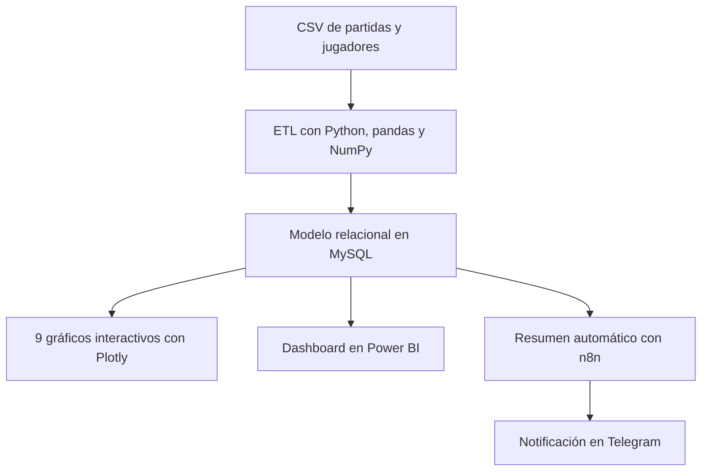

# Análisis end-to-end de datos de videojuegos

Proyecto de portfolio que transforma un conjunto de datos de práctica en un flujo
reproducible de análisis: documentación, limpieza, almacenamiento relacional,
visualización y automatización de indicadores.

**10.000 partidas · 200 jugadores · 9 visualizaciones · Python · MySQL · Power BI · n8n**

## Resumen del proyecto

El objetivo es convertir datos con errores deliberados de formato y calidad en
información preparada para análisis. El pipeline parte de dos CSV, aplica reglas
documentadas con pandas y NumPy, carga un modelo relacional en MySQL y genera
gráficos interactivos con Plotly. El dashboard de Power BI y el flujo de n8n
completan la presentación y el envío automatizado de resultados.

Este repositorio demuestra un proceso completo, no solo la creación de gráficos.

## Resultados verificados

Las siguientes métricas se calculan después de ejecutar la limpieza:

| Indicador | Resultado |
|---|---:|
| Filas recibidas | 10.075 partidas |
| Duplicados eliminados | 75 |
| Partidas limpias | 10.000 |
| Jugadores | 200 |
| Valores de puntos anómalos corregidos | 60 |
| Mapa con más partidas | Puerto Escarlata (1.712) |
| Puntos medios | 957,1 |
| K/D medio | 1,56 |
| Victorias sobre resultados registrados | 53,0 % |

La relación entre duración y puntos es prácticamente nula en los tres modos:
Casual (0,009), Ranked (0,005) y Torneo (-0,003). Por eso se representa mediante
promedios por tramos de duración, en lugar de sugerir una relación que los datos
no respaldan.

## Arquitectura



## Competencias demostradas

| Área | Evidencia en el proyecto |
|---|---|
| Calidad de datos | Tipos, fechas, nulos, duplicados, texto y atípicos |
| Python | Pipeline modular, funciones reutilizables y pruebas |
| SQL y MySQL | Esquema relacional, clave foránea, UPSERT y validaciones |
| Análisis | Estadística descriptiva e indicadores derivados |
| Visualización | Nueve gráficos Plotly y dashboard Power BI |
| Automatización | Webhook de n8n y envío opcional a Telegram |
| Ingeniería | Variables de entorno, CI y dependencias declaradas |

## Decisiones de calidad de datos

- Las fechas se normalizan desde tres formatos distintos.
- Los puntos con un cero doble añadido se detectan con IQR y se corrigen solo
  cuando el valor resultante entra en un rango plausible.
- Los duplicados se eliminan mediante su identificador de partida.
- Los valores ausentes de `kills` se imputan con la mediana.
- Una región ausente se etiqueta como `Desconocida`; no se asigna una región al azar.
- Los nicks solo se separan cuando existe evidencia suficiente; no se inventan
  nombres ni apellidos.
- El ratio K/D conserva dos decimales y las divisiones entre cero quedan como nulas.
- La carga en MySQL comprueba que no existan partidas sin jugador asociado.

## Visualizaciones

El pipeline genera los siguientes HTML interactivos dentro de `graficos/`:

1. Evolución de partidas por día.
2. Puntos medios por mapa.
3. Distribución del K/D por modo.
4. Ranking de jugadores por puntos.
5. Porcentaje de victorias por rango.
6. Actividad por región y día.
7. Personajes más utilizados.
8. Reparto de partidas por modo.
9. Puntos medios por tramo de duración.

Los HTML cargan Plotly desde CDN para evitar versionar decenas de megabytes de
archivos regenerables.

## Estructura

| Ruta | Contenido |
|---|---|
| `data/` | Datos de entrada; los CSV limpios se regeneran localmente |
| `graficos/` | Salidas HTML regenerables |
| `lib/carga_mysql.py` | Esquema, carga y validaciones SQL |
| `lib/cargar_datos.py` | Lectura y diccionario de datos |
| `lib/configuracion.py` | Configuración mediante variables de entorno |
| `lib/limpieza_datos.py` | Transformaciones y reglas de calidad |
| `lib/notificar_n8n.py` | Resumen y envío por webhook |
| `lib/visualizacion.py` | Consultas y gráficos Plotly |
| `n8n/` | Plantilla de workflow sin credenciales |
| `tests/` | Pruebas automatizadas |
| `dashboard_videojuego_seed42.pbix` | Dashboard de Power BI |
| `explorar_graficos.ipynb` | Notebook sin salidas incrustadas |
| `main.py` | Punto de entrada del pipeline |

## Puesta en marcha

### 1. Requisitos

- Python 3.10 o superior.
- MySQL 8 o compatible.
- Power BI Desktop, únicamente para abrir el dashboard `.pbix`.

### 2. Crear el entorno

```bash
git clone https://github.com/nietomoreno84-lgtm/proyecto_final_bigdata.git
cd proyecto_final_bigdata
python -m venv .venv
```

En Windows:

```powershell
.venv\Scripts\Activate.ps1
pip install -r requirements.txt
Copy-Item .env.example .env
```

En macOS o Linux:

```bash
source .venv/bin/activate
pip install -r requirements.txt
cp .env.example .env
```

### 3. Configurar MySQL

Edita el archivo local `.env`:

```dotenv
MYSQL_HOST=localhost
MYSQL_PORT=3306
MYSQL_USER=root
MYSQL_PASSWORD=tu_clave_local
MYSQL_DATABASE=videojuego_seed42
```

El archivo `.env` está excluido de Git. Nunca subas contraseñas, tokens o
webhooks reales al repositorio.

### 4. Ejecutar

```bash
python main.py
```

La notificación a n8n es opcional:

```bash
python main.py --notificar
```

Para utilizarla, configura `N8N_WEBHOOK_URL` en `.env` e importa la plantilla
`n8n/workflow_resumen_n8n.json`. Después selecciona tus propias credenciales de
Telegram y sustituye `CONFIGURA_TU_CHAT_ID` dentro de n8n.

## Pruebas y calidad

```bash
pip install -r requirements-dev.txt
ruff check .
pytest -q
```

GitHub Actions ejecuta ambos controles automáticamente en cada propuesta de
cambios hacia `main`.

## Próximas mejoras

- Añadir capturas optimizadas de las páginas principales de Power BI.
- Contenerizar MySQL y el pipeline con Docker Compose.
- Publicar una versión demostrable del dashboard sin datos sensibles.

---

Desarrollado como proyecto final de formación en Ingeniería de Datos y Big Data.
